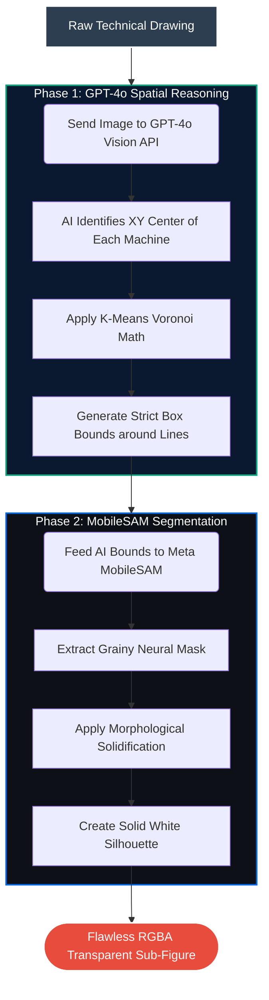

# AI-Powered Technical Diagram Segmenter 🔍

This project automates the extraction of individual machine components from complex, multi-figure technical drawings. It has evolved past traditional mathematical OpenCV bounds and relies exclusively on a **State-of-the-Art Dual-AI Pipeline** featuring OpenAI's GPT-4o and Meta's Segment Anything Model (SAM).

## ✨ The Dual-Brain Architecture

The robust segmentation process dynamically switches between logical layout understanding and pixel-perfect neural trace extraction:



### Step 1: Brain (GPT-4o Semantic Spatial Reasoning)
- The raw schematic image is encoded and sent to **GPT-4o**. 
- GPT-4o acts as the "Domain Expert," performing Document Layout Analysis to intuitively understand the structure of the schematic. 
- It drops exact pinpoint coordinates `(X, Y)` onto the heart of every distinct machine and cleanly ignores background text.
- To handle floating or disconnected lines natively present in technical drawings (like disconnected side-rails), the script applies a robust **K-Means KDTree Voronoi Splitting algorithm** around GPT-4o's semantic bounds to capture exactly which stray lines belong to which geometric cluster.

### Step 2: Scalpel (Meta's Segment Anything Model - MobileSAM)
- The precise geographical Box Bounds derived from Step 1 are fed to Meta's **MobileSAM** neural network.
- As a **Bounding Box Prompt**, the bounding box actively forces SAM to natively shrink-wrap all the grouped fragments in the box and contour them as a single monolithic entity.
- To handle "porous" or "checkered" line art (since SAM ordinarily just segments the pencil strokes), the SAM neural masks are subjected to an external morphologic solidification process. This guarantees perfectly clean, 100%-filled interior white-background extractions!

---

## 🚀 Setup Instructions

1. **Clone the project** and open the directory.
2. **Create a Python Virtual Environment**:
   ```bash
   python -m venv .venv
   .\.venv\Scripts\activate   # (Windows)
   ```
3. **Install Dependencies**:
   ```bash
   pip install -r requirements.txt
   ```
   *(Note: The SAM neural integration is powered by the `ultralytics` package. `MobileSAM.pt` will automatically download from Ultralytics on your first run.)*
4. **Environment Variables**:
   Create a `.env` file in the root directory and add your OpenAI API Key:
   ```env
   OPENAI_API_KEY="sk-proj-xxxxxxxxxxxxxxxxxxxxxxxx"
   ```

---

## 💻 Running the App
The tool provides an interactive front-end powered by Streamlit.

1. Boot the application:
   ```bash
   streamlit run app.py
   ```
2. Upload your technical drawing (e.g. `.png`, `.jpg`).
3. Sit back and watch the Magic! 🪄
    - The AI will sequentially compute the semantic layout and map the Voronoi domains.
    - Meta's SAM will segment the structures and execute the transparent RGBA cutouts perfectly formatted for your final technical manual.